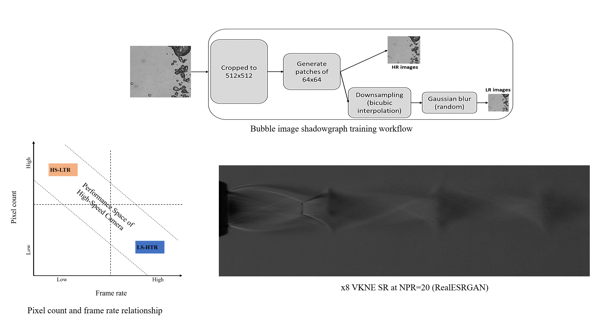

# Blind-Super-Resolution-of-Schlieren-Supersonic-Flows

Super resolution of low spatial resolution of schlieren imaging of supersonic freejet enhanced by x4 and x8 using Enhanced Generative Adversarial Networks framework (ESRGAN) and Real Enhanced Generative Adversarial Networks framework (RealESRGAN) via transfer learning without ground truth images

High resolution and low resolution training datasets are obtained from Bubble shadowgraphy imaging of bubbly jet and used to train the ESRGAN and RealESRGAN networks.
